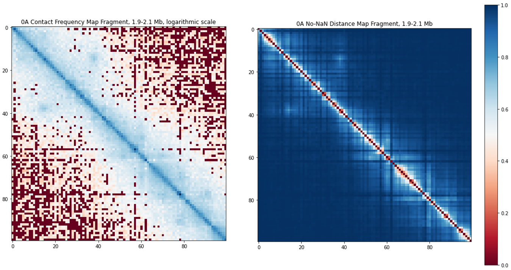

# Topology loop caller
## Table of Contents
- [Overview](#overview)<br>
      - [Chromatin structure and analysis methods](#chromatin-structure-and-analysis-methods)<br>
      - [Topological Data Analysis (TDA)](#topological-data-analysis--tda-)
- [Data processing pipeline](#data-processing-pipeline)
- [Installation](#installation)
- [Input Data](#input-data)
- [Output Data](#output-data)
- [Dependencies](#dependencies)
- [Usage examples](#usage-examples)
# Overview
#### Chromatin structure and analysis methods
Chromatin displays highly sophisticated levels of structural organization, each of them affecting key cellular processes.<br>
<p align="center"></p>
<p align="center"> <b>Figure 1.</b> The organization of eukaryotic chromatin, adapted from Magaña-Acosta and Valadez-Graham, 2020.</p>

**Chromosome conformation capture (3C) techniques** allow us to study the three-dimensional structure as a whole. For instance **Hi-C**, being one of 3C methods, allows the acquisition of a genome-wide contact map.<br>
<p align="center"></p>
<p align="center"> <b>Figure 2.</b> An example of an unbalanced contact frequency heatmap, a fragment of <i>D. melanogaster</i> Hi-C matrix.</p>

The existing methods of Hi-C data analysis allow to identify the main chromatin structure components: compartments, chromosomal territories, topologically associating domains, and loops — but these methods either require huge computational resources and manual selection of the calling parameters, or make certain assumptions, limiting the possible search field.
#### Topological Data Analysis (TDA)
The challenges of non-universality and **large amounts of input data with stochastic noise** could be tackled by **Topological Data Analysis (TDA)**, the key advantages of which are the robustness to the noise of the input data, relatively high processivity and intrinsic idea of the analysis of the shape of the data.<br>
<p align="center"></p>
<p align="center"> <b>Figure 3.</b> Persistent homologies rationale of the finite point cloud in the R2 plane.</p>

The described project is aiming to apply one of the methods of topological analysis — persistent homology, to create a **chromatin loop – calling tool** based on Hi-C data. To solve this task, we are developing an algorithm for translating the contact matrix into a matrix of non-Euclidean distances, topological analysis of the resulted topological space, generation of topological features, filtration, machine learning (ML) model training, and loop visualization. To validate the developed tool, we are comparing it with other loop calling methods, showing the comparative ability of our tool to predict loop coordinates with high accuracy.
The application of persistent homology analysis in chromatin studies is not limited by loop calling procedure: TDA might also be suitable for the identification of **topologically associating domain (TAD) borders** and **higher order structures** with the analysis of the  homologies of different orders. Thus, in our future research in this direction we are devising an **integrative 3D chromatin structure analysis tool**.
# Data processing pipeline
Therefore data processing consists of the following steps:
1. Transform .cool Hi-C file to NumPy matrix; 
2. Convert NumPy contact map to distance matrix, save the output;
3. Perform persistent homology analysis using *Eirene* library of *Julia* programming language;
4. Save the output of persistent homology analysis as tab-separated-values (TSV) file with homologies and their features;
5. Filter homologies of the order of interest;
6. Generate features (lifetime, perimeter, et cetera);
7. Predict loop coordinates with the existing models or train the new one suited for your organism of interest.

# Installation
```
git clone https://github.com/aleskunder/topology_loop_caller.git
cd topology_loop_caller
python3 setup.py install
```
* <a href="https://julialang.org/downloads/platform/#linux_and_freebsd">Instructions</a> how to install Julia;
* <a href="https://www.jousefmurad.com/coding/install-julia-jupyter-notebook/">Instructions</a> how to add Julia to Jupyter Notebooks. Note: after installing all required Julia packages in the Julia interface:
```
using Pkg
Pkg.update()
Pkg.build("IJulia")
```

# Input Data
Hi-C matrices with *.cool* or *.mcool* formats.
The procedure of distance map acquisition may not be limited to Hi-C data only: Micro-C, SPRITE, GAM, and other 3C methods with the interaction frequency matrices as an output are also suitable.

# Output Data
* Distance matrix for the given Hi-C matrix;<br>
<p align="center"></p>
<p align="center"> <b>Figure 4.</b> An illustration of visual contact map patterns preservation: the same fragment from the <i>Dictyostelium discoideum</i> contact map and distance map displays the key visual patterns of loops at the same positions.</p>

* TSV file with filtered homologies and their features;
* TSV file with Predicted loop coordinates.<br>
<p align="center"></p>
<p align="center"> <b>Figure 5.</b> A fragment of the <i>Dictyostelium discoideum</i> Hi-C contact map displaying the loop calling results of different tools.</p>

# Dependencies
* Python >= 3.8
* Julia

All required Python packages are listed in the requirements.txt file located in the repository. All required Julia packages are listed in the julia_requirements.txt file located in the repository.

# Usage examples
Jupyter Notebooks with the pipeline example are located in example_notebooks folder.
